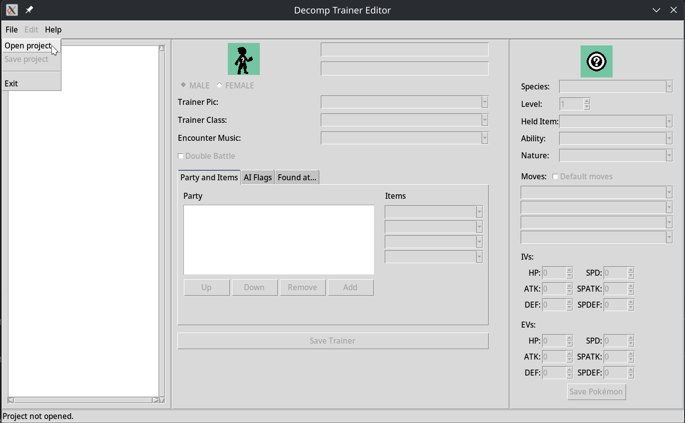
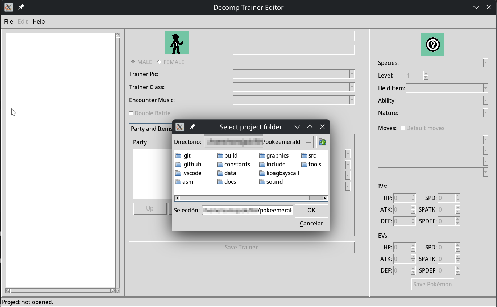
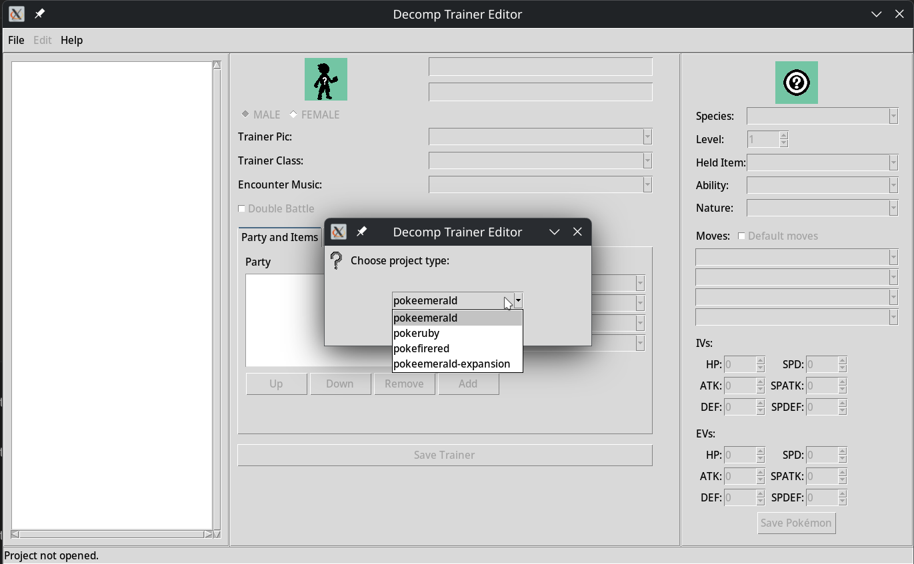
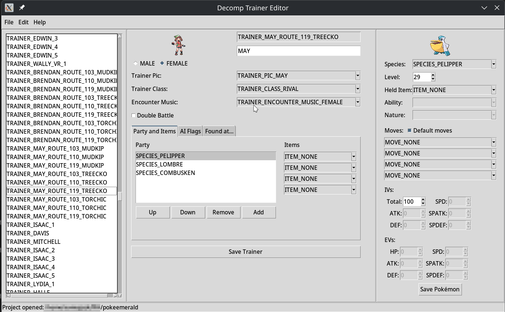
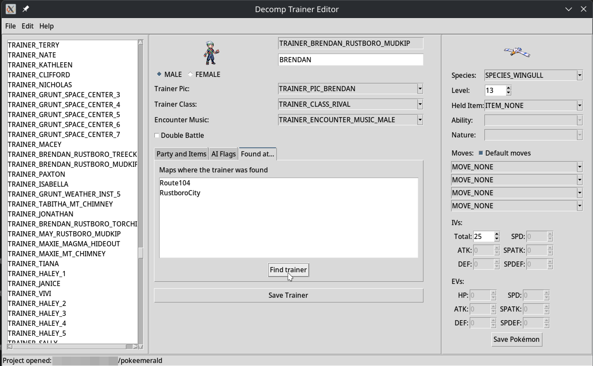

# Decomp Trainer Editor

**Decomp Trainer Editor** is a Python-based graphical tool for editing trainer and Pokémon data in Pokémon *decompilation projects* such as **pokeemerald**, **pokefirered**, **pokeruby**, and **pokeemerald-expansion** (WIP).

The application allows you to **load, view, edit, and save** trainer definitions directly from the project source files, without manually editing C headers.

---

## 🖼️ Screenshots

### Project selection




### Project type selection


### Trainer List & General Data


### Trainer location


---

## 🧠 What does it do?

Decomp Trainer Editor provides a GUI to:

- 📁 Select a supported Pokémon decomp project
- 📜 Parse trainer-related data from the repository
- 🧍 Edit trainer properties (class, name, items, AI flags, music, etc.)
- 🐾 Edit Pokémon party data (species, level, moves, items, IVs)
- 💾 Save changes back into `trainers.h` and `trainer_parties.h`
- 🗄️ Automatically create backups before overwriting files

---

## ✨ Features

- GUI built with **Tkinter**
- Supports multiple decomp projects:
  - `pokeemerald`
  - `pokefirered`
  - `pokeruby`
  - `pokeemerald-expansion` (Not supported in this version)
- Automatic parsing of:
  - Trainers
  - Pokémon species
  - Moves
  - Items
  - AI flags
- Clean regeneration of trainer data files
- Automatic backup system when saving

---

## 📁 Project Structure

```

decomp_trainer_editor/
├── assets/
│   ├── project_files.json
│   ├── trainer_placeholder.png
│   ├── pokemon_placeholder.png
│   └── screenshots/
│       ├── project_selection_opening_1.png
│       ├── project_selection_opening_2.png
│       ├── project_selection_type.png
│       ├── trainer_editor.png
│       └── trainer_location.png
├── src/
│   ├── main.py
│   └── modules/
│       ├── ProjectSelection.py
│       ├── ParseRepoData.py
│       ├── SaveTrainerData.py
│       └── classes.py
├── README.md
└── LICENSE

```

---

## 📦 Requirements

- **Python 3.8+**
- **Tkinter**

> ℹ️ Tkinter is included by default with Python on Windows and macOS.  
> On some Linux distributions you may need:
>
> ```bash
> sudo apt install python3-tk
> ```

---

## 🚀 Installation & Usage

### 1. Clone the repository

```bash
git clone https://github.com/ExcmoJack/decomp_trainer_editor.git
cd decomp_trainer_editor
```

---

### 2. Run the application

```bash
python3 src/main.py
```

---

### 3. Workflow

1. Choose the **project directory**
2. Select your **decomp project type**
3. Browse and select trainers
4. Edit trainer and Pokémon data
5. Save changes (backups are created automatically)
   * 5.1 Save the Pokémon Data
   * 5.2 Save the Trainer Data
   * 5.3 Save the project (vía **File** > **Save project**)

---

## 🛠️ Internal Architecture

### Parsing (`ParseRepoData.py`)

* Reads constants and trainer definitions from the decomp repository
* Extracts trainers, Pokémon parties, items, moves, and flags
* Converts raw data into Python objects

### Example

This editor expects valid decompiled trainer definitions such as:

```c
[TRAINER_FLANNERY_1] =
    {
        .trainerClass = TRAINER_CLASS_LEADER,
        .encounterMusic_gender = F_TRAINER_FEMALE | TRAINER_ENCOUNTER_MUSIC_FEMALE,
        .trainerPic = TRAINER_PIC_LEADER_FLANNERY,
        .trainerName = _("FLANNERY"),
        .items = {ITEM_HYPER_POTION, ITEM_HYPER_POTION, ITEM_NONE, ITEM_NONE},
        .doubleBattle = FALSE,
        .aiFlags = AI_SCRIPT_CHECK_BAD_MOVE | AI_SCRIPT_TRY_TO_FAINT | AI_SCRIPT_CHECK_VIABILITY,
        .party = ITEM_CUSTOM_MOVES(sParty_Flannery1),
    },
```

```c
static const struct TrainerMonItemCustomMoves sParty_Flannery1[] = {
    {
    .iv = 200,
    .lvl = 24,
    .species = SPECIES_NUMEL,
    .heldItem = ITEM_NONE,
    .moves = {MOVE_OVERHEAT, MOVE_TAKE_DOWN, MOVE_MAGNITUDE, MOVE_SUNNY_DAY}
    },
    {
    .iv = 200,
    .lvl = 24,
    .species = SPECIES_SLUGMA,
    .heldItem = ITEM_NONE,
    .moves = {MOVE_OVERHEAT, MOVE_SMOG, MOVE_LIGHT_SCREEN, MOVE_SUNNY_DAY}
    },
    {
    .iv = 250,
    .lvl = 26,
    .species = SPECIES_CAMERUPT,
    .heldItem = ITEM_NONE,
    .moves = {MOVE_OVERHEAT, MOVE_TACKLE, MOVE_SUNNY_DAY, MOVE_ATTRACT}
    },
    {
    .iv = 250,
    .lvl = 29,
    .species = SPECIES_TORKOAL,
    .heldItem = ITEM_WHITE_HERB,
    .moves = {MOVE_OVERHEAT, MOVE_SUNNY_DAY, MOVE_BODY_SLAM, MOVE_ATTRACT}
    }
};
```

---

### Data Models (`classes.py`)

Defines the core data structures:

* `Trainer`
* `Pokemon`
* Flags and helper enums

These objects are used by the GUI and the save system.

---

### Saving (`SaveTrainerData.py`)

* Regenerates:

  * `trainers.h`
  * `trainer_parties.h`
* Preserves formatting and structure
* Automatically creates backup copies of original files

---

### Project Selection (`ProjectSelection.py`)

* GUI window for choosing project type
* Allows to load project-specific configuration from `assets/project_files.json`

---

## ⚠️ Notes & Tips

* Always keep a **manual backup** of your project before editing.
* Different decomp projects may have **slightly different macros or layouts**.
* This tool assumes **standard trainer structures** used in popular decomp repos.

---

## 🤝 Contributing

Contributions are welcome! Ideas include:

* Support for additional decomp projects
* UI/UX improvements
* Validation and error handling

---

## 📄 License

This project is licensed under the terms described in the `LICENSE` file.

---

## ❤️ Acknowledgements

Inspired by the Pokémon decompilation and ROM hacking community.

